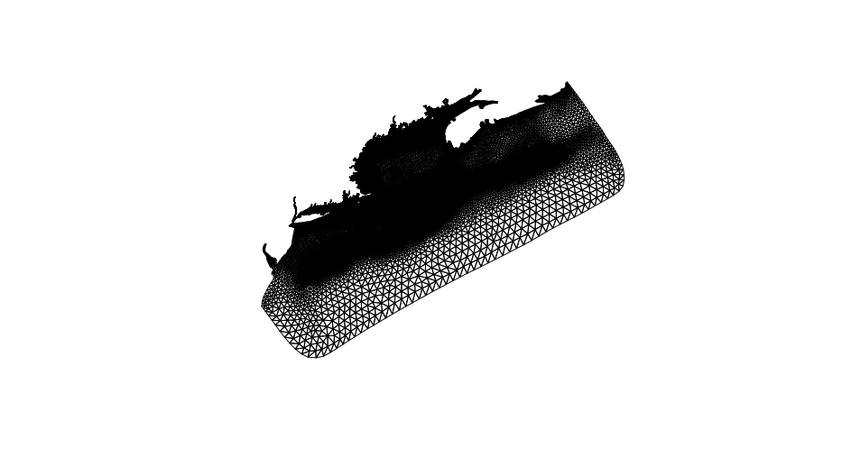
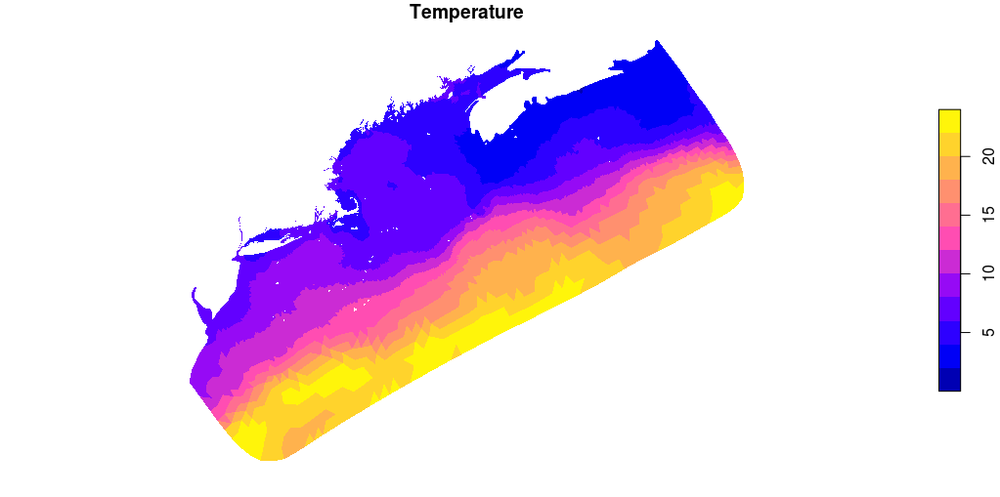

# fvcom

Convenience accessing FVCOM datasets.

### Background

[FVCOM](http://fvcom.smast.umassd.edu/fvcom/) produces ocean circulation models
on an irregular mesh. Here is the [user manual](http://fvcom.smast.umassd.edu/wp-content/uploads/2013/11/MITSG_12-25.pdf) which looks like a good cure for being bored!

As an example, [NECOFS](http://fvcom.smast.umassd.edu/necofs/) leverages this mesh
to deliver models for the Gulf of Maine, Mass coastal waters and a small number
of estuaries.  NECOFS provides an [interactive web map](http://134.88.228.119:8080/fvcomwms/)


#### Gulf of Maine centric products

There are a number of models with a Gulf of Maine bend including
[forecasts](http://www.smast.umassd.edu:8080/thredds/forecasts.html) and
[archives](http://www.smast.umassd.edu:8080/thredds/catalog/models/fvcom/NECOFS/Archive/NECOFS_GOM/catalog.html)


### Requirements

+ [ncdf4](https://cran.r-project.org/package=ncfd4)


### Installation

```
devtools::install_github("BigelowLab/fvcom")
````


## Data Access

Data are served via OPeNDAP on a [THREDDS server](http://www.smast.umassd.edu:8080/thredds/catalog.html)
THREDDS servers blend a simple user-navigable interface (similar to a file browser)
with a machine readable data [XML map](http://www.smast.umassd.edu:8080/thredds/catalog.xml)
Note the change in the file extension.  Files served this way permit the user to
treat the product as if it were a local file, allowing selective downlaod and
access in a familar NetCDF format with needing to downlaod the entire file.

NECOFS has it's own [THREDDS directory](http://www.smast.umassd.edu:8080/thredds/catalog/models/fvcom/NECOFS/catalog.html)
including a subdirectory for the GoM FVCOM models.


## Accessing FVCOM data

Open the FVCOM resource as you would any NetCDF file.

```{r}
library(fvcom)
library(ncdf4)
uri_base <- "http://www.smast.umassd.edu:8080/thredds/dodsC/models/fvcom/NECOFS/Archive/NECOFS_GOM/2019/"
uri <- file.path(uri_base, "gom4_201901.nc")
x <- nc_open(uri)
x
#      ...blah...
#      53 variables (excluding dimension variables):
#         ...blah...
#         float lon[node]   
#             long_name: nodal longitude
#             standard_name: longitude
#             units: degrees_east
#         float lat[node]   
#             long_name: nodal latitude
#             standard_name: latitude
#             units: degrees_north
#         float xc[nele]   
#             long_name: zonal x-coordinate
#             units: meters
#         float yc[nele]   
#             long_name: zonal y-coordinate
#             units: meters
#         ...blah...
```

### Nodes and Elements

The mesh is defined by non-intersecting triangular elements bounded by three nodes. Nodes are
shown below as the solid dots, three nodes define the boundary of element.  Scalar values,
like temperature, salinty and height are defined at nodes.  Vector values, such as velocity are defined
at the element centroids.  Within the NetCDF object you can make complete identification by examining
which variables use the `node` dimensions versus those that use the `nele` dimension.


### Node and Element locations

Use the functions `fvcom_nodes` and `fvcom_elems` to extract location information
as either `xy` or `lonlat` pairs.  Note we get both xy and lonlat here for nodes.  The
same can be had for elements. 

```
dplyr::left_join(fvcom::fvcom_nodes(x, what = 'lonlat'), 
                 fvcom::fvcom_nodes(x, what = 'xy'), by = "node")
# Joining, by = "node"
# # A tibble: 53,087 x 5
#     node   lon   lat       x       y
#    <int> <dbl> <dbl>   <dbl>   <dbl>
#  1     1 -59.8  46.1 1699880 420500 
#  2     2 -59.8  46.1 1705180 414890 
#  3     3 -59.7  46.0 1709910 409690 
#  4     4 -59.6  46.0 1715778 403368.
#  5     5 -59.6  45.9 1722603 395907 
#  6     6 -59.5  45.8 1730039 387611.
#  7     7 -59.4  45.7 1737004 380188.
#  8     8 -59.3  45.7 1744943 371707.
#  9     9 -59.2  45.6 1752036 363693 
# 10    10 -59.1  45.5 1761284 353679.
# # … with 53,077 more rows
```

### Timestamps

Retrieving the timestamps provides you with a choice for assumptions you want
to make about the hourly model output.  Timestamps stored internally do not land
on each hour.

```
head(fvcom_time(x, internal = TRUE), n = 6)
# [1] "2019-01-01 00:00:00 UTC" "2019-01-01 01:01:52 UTC" "2019-01-01 01:58:07 UTC"
# [4] "2019-01-01 03:00:00 UTC" "2019-01-01 04:01:52 UTC" "2019-01-01 04:58:07 UTC"
```

We can get a proxy for these times, but *prettily* settled on each hour. The choice is yours.

```
head(fvcom_time(x, internal = FALSE), n = 6)
# [1] "2019-01-01 00:00:00 UTC" "2019-01-01 01:00:00 UTC" "2019-01-01 02:00:00 UTC"
# [4] "2019-01-01 03:00:00 UTC" "2019-01-01 04:00:00 UTC" "2019-01-01 05:00:00 UTC"
```

### Variables

Variables (the oceanographic ones) can be extract by node or element. It is possible to
select a subset, but the operation is quick and it is just as easy to subset once
you have the table in hand.

```
# v <- get_node_var <- function(x, var = 'zeta')
# # A tibble: 53,087 x 2
#     node      zeta
#    <int>     <dbl>
#  1     1  0.000472
#  2     2 -0.0177  
#  3     3 -0.0272  
#  4     4 -0.0446  
#  5     5 -0.0637  
#  6     6 -0.0821  
#  7     7 -0.102   
#  8     8 -0.107   
#  9     9 -0.0950  
# 10    10 -0.0969  
# # … with 53,077 more rows
```

### Mesh

Some computation is required (not a lot) to produce the mesh which is comprised of
non-intersecting polygons (triangles).

```
mesh <- get_node_mesh_geometry(x, what = 'lonlat')
# Simple feature collection with 99074 features and 3 fields
# geometry type:  POLYGON
# dimension:      XY
# bbox:           xmin: -75.68433 ymin: 35.27653 xmax: -56.85079 ymax: 46.14595
# epsg (SRID):    4326
# proj4string:    +proj=longlat +datum=WGS84 +no_defs
# # A tibble: 99,074 x 4
#       p1    p2    p3 geometry
#    <int> <int> <int> <POLYGON [°]>
#  1     1     2    95 ((-59.81069 46.14595, -59.75268 46.09011, ...
#  2     1    95    96 ((-59.81069 46.14595, -59.82597 46.0583, ...
#  3     2     3    95 ((-59.75268 46.09011, -59.70132 46.03855, ...
#  4     3     4    98 ((-59.70132 46.03855, -59.63753 45.97571, ...
#  5     3    95    97 ((-59.70132 46.03855, -59.82597 46.0583, ...
#  6     3    97    98 ((-59.70132 46.03855, -59.78879 46.00403,...
#  7     4     5    99 ((-59.63753 45.97571, -59.56369 45.90162, ...
#  8     4    98    99 ((-59.63753 45.97571, -59.72971 45.94034, ...
#  9     5     6   100 ((-59.56369 45.90162, -59.48375 45.8194, ...
# 10     5    99   100 ((-59.56369 45.90162, -59.65802 45.86837, ...
# # … with 99,064 more rows

plot(sf::st_geometry(mesh))
```

We can assign variable values to the polygons by reusing the mesh table.

```
mesh <- get_node_mesh(x, vars = c("temp", "salinity"), mesh = mesh)
# Simple feature collection with 99074 features and 5 fields
# geometry type:  POLYGON
# dimension:      XY
# bbox:           xmin: -75.68433 ymin: 35.27653 xmax: -56.85079 ymax: 46.14595
# epsg (SRID):    4326
# proj4string:    +proj=longlat +datum=WGS84 +no_defs
# # A tibble: 99,074 x 6
#     temp salinity    p1    p2    p3                                  geometry
#    <dbl>    <dbl> <int> <int> <int>                             <POLYGON [°]>
#  1  3.17     30.2     1     2    95 ((-59.81069 46.14595, -59.75268 46.09011,…
#  2  3.04     30.2     1    95    96 ((-59.81069 46.14595, -59.82597 46.0583, …
#  3  3.15     30.2     2     3    95 ((-59.75268 46.09011, -59.70132 46.03855, …
#  4  3.09     30.4     3     4    98 ((-59.70132 46.03855, -59.63753 45.97571,…
#  5  2.97     30.2     3    95    97 ((-59.70132 46.03855, -59.82597 46.0583, …
#  6  2.98     30.3     3    97    98 ((-59.70132 46.03855, -59.78879 46.00403, …
#  7  2.94     30.5     4     5    99 ((-59.63753 45.97571, -59.56369 45.90162, …
#  8  2.89     30.4     4    98    99 ((-59.63753 45.97571, -59.72971 45.94034, …
#  9  2.87     30.5     5     6   100 ((-59.56369 45.90162, -59.48375 45.8194, …
# 10  2.87     30.5     5    99   100 ((-59.56369 45.90162, -59.65802 45.86837, …
# # … with 99,064 more rows

plot(mesh['temp'], lty = 'blank', main = 'Temperature')
```

