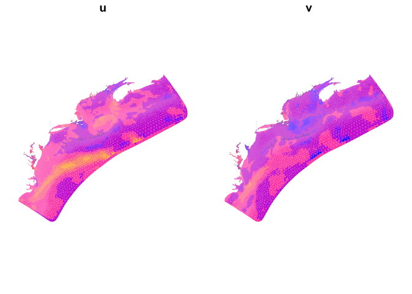

FVCOM
================

Convenient access to [FVCOM](https://www.fvcom.org/) datasets from R.

# Background

[FVCOM](https://www.fvcom.org/) produces ocean circulation models on an
irregular mesh. Here is the [user
manual](http://fvcom.smast.umassd.edu/wp-content/uploads/2013/11/MITSG_12-25.pdf).

As an example, [NECOFS](http://134.88.228.119:8080/fvcomwms/) leverages
this mesh to deliver models for the Gulf of Maine, Mass coastal waters
and a small number of estuaries. NECOFS provides an THREDDS catalog of
its OPeNDAP resources.

# Requirements

- [R 4.1+](https://www.r-project.org/)
- [rlang](https://cran.r-project.org/package=rlang)
- [ncdf4](https://cran.r-project.org/package=ncfd4)
- [tibble](https://cran.r-project.org/package=tibble)
- [dplyr](https://cran.r-project.org/package=dplyr)
- [sf](https://cran.r-project.org/package=sf)
- [stars](https://cran.r-project.org/package=stars)
- [locate](https://github.com/BigelowLab/locate) \# Not available on
  CRAN

# Installation

    remotes::install_github("BigelowLab/locate")`
    remotes::install_github("BigelowLab/fvcom")

# Gulf of Maine centric products

There are a number of models with a Gulf of Maine focus including
[forecasts](http://www.smast.umassd.edu:8080/thredds/catalog/models/fvcom/NECOFS/Forecasts/catalog.html)
and
[hindcasts](http://www.smast.umassd.edu:8080/thredds/catalog/models/fvcom/NECOFS/Archive/Seaplan_33_Hindcast_v1/catalog.html).
For each of these OPeNDAP resources we have provided a simple interface
class.

- [GOM](http://www.smast.umassd.edu:8080/thredds/dodsC/models/fvcom/NECOFS/Forecasts/NECOFS_GOM3_FORECAST.nc.html)
  `GOMPhysics()`

- [Boston](http://www.smast.umassd.edu:8080/thredds/dodsC/models/fvcom/NECOFS/Forecasts/NECOFS_FVCOM_OCEAN_BOSTON_FORECAST.nc.html)
  `BostonPhysics()`

- [Scituate](http://www.smast.umassd.edu:8080/thredds/dodsC/models/fvcom/NECOFS/Forecasts/NECOFS_FVCOM_OCEAN_SCITUATE_FORECAST.nc.html)
  `ScituatePhysics()`

- [Mass
  Bay](http://www.smast.umassd.edu:8080/thredds/dodsC/models/fvcom/NECOFS/Forecasts/NECOFS_FVCOM_OCEAN_MASSBAY_FORECAST.nc.html)
  `MassBayPhysics()`

- [Saco
  Bay](http://www.smast.umassd.edu:8080/thredds/dodsC/models/fvcom/NECOFS/Forecasts/NECOFS_FVCOM_OCEAN_SACO_FORECAST.nc.html)
  `SacoBayPhysics()`

- [Hampton](http://www.smast.umassd.edu:8080/thredds/dodsC/models/fvcom/NECOFS/Forecasts/NECOFS_FVCOM_OCEAN_HAMPTON_FORECAST.nc.html)
  `HamptonPhysics()`

- [Global](http://www.smast.umassd.edu:8080/thredds/dodsC/models/fvcom/NECOFS/Forecasts/NECOFS_FVCOM_OCEAN_GLOBAL_FORECAST.nc.html)
  `GlobalPhysics()`

# Accessing FVCOM data

``` r
suppressPackageStartupMessages({
  library(sf) 
  library(fvcom) 
  library(ncdf4) 
  library(dplyr)
})
```

Open the FVCOM resource as you would any NetCDF file.

``` r
uri_base <- "http://www.smast.umassd.edu:8080/thredds/dodsC/models/fvcom/NECOFS/Archive/Seaplan_33_Hindcast_v1"
uri <- file.path(uri_base, "gom5_201812.nc")
x <- nc_open(uri)
x
```

    ## File http://www.smast.umassd.edu:8080/thredds/dodsC/models/fvcom/NECOFS/Archive/Seaplan_33_Hindcast_v1/gom5_201812.nc (NC_FORMAT_CLASSIC):
    ## 
    ##      46 variables (excluding dimension variables):
    ##         int nprocs[]   
    ##             long_name: number of processors
    ##         int partition[nele]   
    ##             long_name: partition
    ##         float x[node]   
    ##             long_name: nodal x-coordinate
    ##             units: meters
    ##         float y[node]   
    ##             long_name: nodal y-coordinate
    ##             units: meters
    ##         float lon[node]   
    ##             long_name: nodal longitude
    ##             standard_name: longitude
    ##             units: degrees_east
    ##         float lat[node]   
    ##             long_name: nodal latitude
    ##             standard_name: latitude
    ##             units: degrees_north
    ##         float xc[nele]   
    ##             long_name: zonal x-coordinate
    ##             units: meters
    ##         float yc[nele]   
    ##             long_name: zonal y-coordinate
    ##             units: meters
    ##         float lonc[nele]   
    ##             long_name: zonal longitude
    ##             standard_name: longitude
    ##             units: degrees_east
    ##         float latc[nele]   
    ##             long_name: zonal latitude
    ##             standard_name: latitude
    ##             units: degrees_north
    ##         float siglay_center[nele,siglay]   
    ##             long_name: Sigma Layers
    ##             standard_name: ocean_sigma/general_coordinate
    ##             positive: up
    ##             valid_min: -1
    ##             valid_max: 0
    ##             formula_terms: sigma: siglay_center eta: zeta_center depth: h_center
    ##         float siglev_center[nele,siglev]   
    ##             long_name: Sigma Levels
    ##             standard_name: ocean_sigma/general_coordinate
    ##             positive: up
    ##             valid_min: -1
    ##             valid_max: 0
    ##             formula_terms: sigma:siglay_center eta: zeta_center depth: h_center
    ##         float h_center[nele]   
    ##             long_name: Bathymetry
    ##             standard_name: sea_floor_depth_below_geoid
    ##             units: m
    ##             positive: down
    ##             grid: grid1 grid3
    ##             coordinates: latc lonc
    ##             grid_location: center
    ##         float h[node]   
    ##             long_name: Bathymetry
    ##             standard_name: sea_floor_depth_below_geoid
    ##             units: m
    ##             positive: down
    ##             grid: Bathymetry_Mesh
    ##             coordinates: x y
    ##             type: data
    ##         int nv[nele,three]   
    ##             long_name: nodes surrounding element
    ##         int iint[time]   
    ##             long_name: internal mode iteration number
    ##         int Itime[time]   
    ##             units: days since 1858-11-17 00:00:00
    ##             format: modified julian day (MJD)
    ##             time_zone: UTC
    ##         int Itime2[time]   
    ##             units: msec since 00:00:00
    ##             time_zone: UTC
    ##         char Times[maxStrlen64,time]   
    ##             time_zone: UTC
    ##         float zeta[node,time]   
    ##             long_name: Water Surface Elevation
    ##             units: meters
    ##             positive: up
    ##             standard_name: sea_surface_height_above_geoid
    ##             grid: Bathymetry_Mesh
    ##             coordinates: time lat lon
    ##             type: data
    ##             location: node
    ##         char file_date[maxStrlen64,time]   
    ##             time_zone: UTC
    ##         float u[nele,siglay,time]   
    ##             long_name: Eastward Water Velocity
    ##             standard_name: eastward_sea_water_velocity
    ##             units: meters s-1
    ##             grid: fvcom_grid
    ##             type: data
    ##             coordinates: time siglay latc lonc
    ##             mesh: fvcom_mesh
    ##             location: face
    ##         float v[nele,siglay,time]   
    ##             long_name: Northward Water Velocity
    ##             standard_name: Northward_sea_water_velocity
    ##             units: meters s-1
    ##             grid: fvcom_grid
    ##             type: data
    ##             coordinates: time siglay latc lonc
    ##             mesh: fvcom_mesh
    ##             location: face
    ##         float tauc[nele,time]   
    ##             long_name: bed stress magnitude from currents
    ##             note1: this stress is bottom boundary condtion on velocity field
    ##             note2: dimensions are stress/rho
    ##             units: m^2 s^-2
    ##             grid: fvcom_grid
    ##             type: data
    ##             coordinates: time latc lonc
    ##             mesh: fvcom_mesh
    ##             location: face
    ##         float omega[node,siglev,time]   
    ##             long_name: Vertical Sigma Coordinate Velocity
    ##             units: s-1
    ##             grid: fvcom_grid
    ##             type: data
    ##         float ww[nele,siglay,time]   
    ##             long_name: Upward Water Velocity
    ##             units: meters s-1
    ##             grid: fvcom_grid
    ##             type: data
    ##         float ua[nele,time]   
    ##             long_name: Vertically Averaged x-velocity
    ##             units: meters s-1
    ##             grid: fvcom_grid
    ##             type: data
    ##         float va[nele,time]   
    ##             long_name: Vertically Averaged y-velocity
    ##             units: meters s-1
    ##             grid: fvcom_grid
    ##             type: data
    ##         float temp[node,siglay,time]   
    ##             long_name: temperature
    ##             standard_name: sea_water_temperature
    ##             units: degrees_C
    ##             grid: fvcom_grid
    ##             coordinates: time siglay lat lon
    ##             type: data
    ##             mesh: fvcom_mesh
    ##             location: node
    ##         float salinity[node,siglay,time]   
    ##             long_name: salinity
    ##             standard_name: sea_water_salinity
    ##             units: 1e-3
    ##             grid: fvcom_grid
    ##             coordinates: time siglay lat lon
    ##             type: data
    ##             mesh: fvcom_mesh
    ##             location: node
    ##         float viscofm[nele,siglay,time]   
    ##             long_name: Horizontal Turbulent Eddy Viscosity For Momentum
    ##             units: m 2 s-1
    ##             grid: fvcom_grid
    ##             coordinates: x y
    ##             type: data
    ##         float viscofh[node,siglay,time]   
    ##             long_name: Horizontal Turbulent Eddy Viscosity For Scalars
    ##             units: m 2 s-1
    ##             grid: fvcom_grid
    ##             coordinates: x y
    ##             type: data
    ##         float km[node,siglev,time]   
    ##             long_name: Turbulent Eddy Viscosity For Momentum
    ##             units: m 2 s-1
    ##             grid: fvcom_grid
    ##             coordinates: x y
    ##             type: data
    ##         float kh[node,siglev,time]   
    ##             long_name: Turbulent Eddy Viscosity For Scalars
    ##             units: m 2 s-1
    ##             grid: fvcom_grid
    ##             coordinates: x y
    ##             type: data
    ##         float kq[node,siglev,time]   
    ##             long_name: Turbulent Eddy Viscosity For Q2/Q2L
    ##             units: m 2 s-1
    ##             grid: fvcom_grid
    ##             coordinates: x y
    ##             type: data
    ##         float q2[node,siglev,time]   
    ##             long_name: Turbulent Kinetic Energy
    ##             units: m2 s-2
    ##             grid: fvcom_grid
    ##             coordinates: x y
    ##             type: data
    ##         float q2l[node,siglev,time]   
    ##             long_name: Turbulent Kinetic Energy X Turbulent Macroscale
    ##             units: m3 s-2
    ##             grid: fvcom_grid
    ##             coordinates: x y
    ##             type: data
    ##         float l[node,siglev,time]   
    ##             long_name: Turbulent Macroscale
    ##             units: m3 s-2
    ##             grid: fvcom_grid
    ##             coordinates: x y
    ##             type: data
    ##         int wet_nodes[node,time]   
    ##             long_name: Wet_Nodes
    ##             grid: fvcom_grid
    ##             type: data
    ##             coordinates: time lat lon
    ##             mesh: fvcom_mesh
    ##             location: node
    ##         int wet_cells[nele,time]   
    ##             long_name: Wet_Cells
    ##             grid: fvcom_grid
    ##             type: data
    ##             coordinates: time latc lonc
    ##             mesh: fvcom_mesh
    ##             location: face
    ##         int wet_nodes_prev_int[node,time]   
    ##             long_name: Wet_Nodes_At_Previous_Internal_Step
    ##             grid: fvcom_grid
    ##             type: data
    ##             coordinates: time lat lon
    ##             mesh: fvcom_mesh
    ##             location: node
    ##         int wet_cells_prev_int[nele,time]   
    ##             long_name: Wet_Cells_At_Previous_Internal_Step
    ##             grid: fvcom_grid
    ##             type: data
    ##             coordinates: time latc lonc
    ##             mesh: fvcom_mesh
    ##             location: face
    ##         int wet_cells_prev_ext[nele,time]   
    ##             long_name: Wet_Cells_At_Previous_External_Step
    ##             grid: fvcom_grid
    ##             type: data
    ##         float MLD_Depth[node,time]   
    ##             long_name: Mixed Layer Depth
    ##             units: m
    ##             grid: fvcom_grid
    ##             coordinates: x y
    ##             type: data
    ##         int ML_Nsiglay[node,time]   
    ##             long_name: Mixed Layer Depth Siglay
    ##             units: none
    ##             grid: fvcom_grid
    ##             coordinates: x y
    ##             type: data
    ##         float UARD_OBCN[nobc,time]   
    ##             long_name: Normal Velocity at boundaries
    ##             units: m 2 s-1
    ##             grid: fvcom_grid
    ##             type: data
    ## 
    ##      8 dimensions:
    ##         time  Size:745   *** is unlimited *** 
    ##             long_name: time
    ##             units: days since 1858-11-17 00:00:00
    ##             format: modified julian day (MJD)
    ##             time_zone: UTC
    ##         maxStrlen64  Size:64 (no dimvar)
    ##         nele  Size:252801 (no dimvar)
    ##         nobc  Size:130 (no dimvar)
    ##         node  Size:138567 (no dimvar)
    ##         siglay  Size:45 
    ##             long_name: Sigma Layers
    ##             standard_name: ocean_sigma/general_coordinate
    ##             positive: up
    ##             valid_min: -1
    ##             valid_max: 0
    ##             formula_terms: sigma: siglay eta: zeta depth: h
    ##         siglev  Size:46 
    ##             long_name: Sigma Levels
    ##             standard_name: ocean_sigma/general_coordinate
    ##             positive: up
    ##             valid_min: -1
    ##             valid_max: 0
    ##             formula_terms: sigma:siglay eta: zeta depth: h
    ##         three  Size:3 (no dimvar)
    ## 
    ##     18 global attributes:
    ##         title: FVCOM GOM NECOFS HINDCAST UPDATE
    ##         institution: School for Marine Science and Technology
    ##         source: FVCOM_4.4
    ##         history: model started at: 27/08/2022   20:22
    ##         references: http://fvcom.smast.umassd.edu, http://codfish.smast.umassd.edu
    ##         Conventions: CF-1.0
    ##         CoordinateSystem: Cartesian
    ##         CoordinateProjection: init=nad83:1802
    ##         Tidal_Forcing: TIDAL ELEVATION FORCING IS OFF!
    ##         River_Forcing: THERE ARE 94 RIVERS IN THIS MODEL.
    ## RIVER INFLOW IS ON THE nodes WHERE TEMPERATURE AND SALINITY ARE calculated IN THE MODEL.
    ## THE FOLLOWING RIVER NAMES ARE USED:
    ## Connecticut_CT
    ## Farmington_CT
    ## Salmon_CT
    ## Quinebaug_CT
    ## Yantic_CT
    ## Shetucket_CT
    ## Housatonic_CT
    ## Quinnipiac_CT
    ## Neponset_MA
    ## Merrimac_MA
    ## Threemile_MA
    ## Wading_MA
    ## Taunton_MA
    ## Paskamanset_MA
    ## Quashnet_MA
    ## Jones_MA
    ## Indian_Head_MA
    ## Charles_MA
    ## Aberjona_MA
    ## Alewife_MA
    ## Saugus_MA
    ## Ipswich_MA
    ## Parker_MA
    ## St_John_basin_ME
    ## St_John_dickey_ME
    ## St_John_fish_ME
    ## Allagash_ME
    ## Aroostook_ME
    ## St_Croix_ME
    ## Penobscot_ME
    ## Androscoggin_ME
    ## Saco_ME
    ## Kennebec_ME
    ## Winnicut_NH
    ## Exeter_NH
    ## Lamprey_NH
    ## Cocheco_NH
    ## Isinglass_NH
    ## Hudson_Fort_Edward_NY
    ## Hudson_Waterford_NY
    ## Mohawk_NY
    ## Hoosic_NY
    ## Hunt_RI
    ## Pawcatuck_RI
    ## Pawtuxet_RI
    ## Moshassuck_RI
    ## Blackstone_RI
    ## Tenmile_RI
    ## Mill_RI
    ## Delaware_NJ
    ## Delaware_Assunpink_NJ
    ## Delaware_Corsswicks_NJ
    ## Delaware_Neshaminy_NJ
    ## North_Branch_Rancocas_NJ
    ## Pennypack_PA
    ## South_Branch_Rancocas_NJ
    ## Schuylkill_PA
    ## Chester_PA
    ## Chester_Brandywine_DE
    ## Chester_Red_Clay_DE
    ## Big_Elk_MD
    ## Susquehanna_MD
    ## Susquehanna_Octoraro_MD
    ## Susquehanna_Deer_MD
    ## Otter_Point_MD
    ## Gunpowder_MD
    ## Gunpowder_Western_MD
    ## Gwynns_MD
    ## Patapsco_MD
    ## Patuxent_MD
    ## Paruxent_Western_MD
    ## Zekiah_Swamp_MD
    ## Potomac_DC
    ## Potomac_NE_Branch_MD
    ## Potomac_Cameron_VA
    ## Potomac_Piscataway_MD
    ## Pomonkey_Mattawoman_MD
    ## Pappahannock_VA
    ## York_Mattaponi_VA
    ## York_Pamunkey_VA
    ## Dragon_Swamp_VA
    ## James_VA
    ## Chickahominy_VA
    ## Chowan_Vlackwater_VA
    ## Chowan_Nottoway_VA
    ## Chowan_Meherrin_VA
    ## Chowan_Potecasi_VA
    ## Roanoke_NC
    ## Tar_NC
    ## Neuse_Trent_NC
    ## Neuse_NC
    ## New_NC
    ## Choptank_MD
    ## Choptank_Tuckahoe_MD
    ##         GroundWater_Forcing: FVCOM variable GroundWater forcing:
    ## FILE NAME:gom5_gwater.nc
    ## SOURCE:FVCOM grid (unstructured) surface forcing
    ## Temperature is specified
    ## Salinity is specified
    ##         Surface_Heat_Forcing: FVCOM variable surface heat forcing file:
    ## FILE NAME:wrf_hnd.nc
    ## SOURCE:wrf2fvcom version 0.13 (2007-07-19) (Bulk method: COARE 2.6Z)
    ## MET DATA START DATE:2017-12-31_00:00:00
    ##         Surface_Wind_Forcing: FVCOM variable surface Wind forcing:
    ## FILE NAME:wrf_hnd.nc
    ## SOURCE:wrf2fvcom version 0.13 (2007-07-19) (Bulk method: COARE 2.6Z)
    ## MET DATA START DATE:2017-12-31_00:00:00
    ##         Surface_PrecipEvap_Forcing: FVCOM periodic surface precip forcing:
    ## FILE NAME:wrf_hnd.nc
    ## SOURCE:wrf2fvcom version 0.13 (2007-07-19) (Bulk method: COARE 2.6Z)
    ## MET DATA START DATE:2017-12-31_00:00:00
    ##         Special_Physical_processes: long shore flow adjustment for thermal wind and wind driven setup
    ##         DODS.strlen: 26
    ##         DODS.dimName: DateStrLen
    ##         DODS_EXTRA.Unlimited_Dimension: time

# Data structure

## Nodes and Elements

The mesh is defined by non-intersecting triangular elements bounded by
three nodes. Nodes are shown below as the solid dots, three nodes define
the boundary of element. Scalar values, like temperature, salinty and
height are defined at nodes. Vector values, such as velocity are defined
at the element centroids. Within the NetCDF object you can make complete
identification by examining which variables use the `node` dimensions
versus those that use the `nele` dimension.

<figure>

<figcaption aria-hidden="true"><em>Fig. 3.11 <strong>from the user
manual</strong>: Schematic of the control volume used to calculate
scalar variables and vertical velocity used in FVCOM. F is a general
symbol representing scalar variables such as zeta, T, S, Km, Kh, and
vertical velocity. A <strong>solid dot</strong> is the node of the
triangles where scalar variable or vertical velocity is calculated and a
<strong>crossed open circle</strong> is the centroid of a triangle where
the horizontal velocity is calculated.</em></figcaption>
</figure>

## Node and Element locations

Use the functions `fvcom_nodes` and `fvcom_elems` to extract location
information as either `xy` or `lonlat` pairs. Note we get both xy and
lonlat here for nodes. The same can be had for elements.

``` r
dplyr::left_join(fvcom::fvcom_nodes(x, what = 'lonlat'),                   
                 fvcom::fvcom_nodes(x, what = 'xy'), by = "node") 
```

    ## # A tibble: 138,567 × 5
    ##     node       lon       lat         x         y
    ##    <int> <dbl[1d]> <dbl[1d]> <dbl[1d]> <dbl[1d]>
    ##  1     1     -59.8      46.1  1699880.   420500.
    ##  2     2     -59.8      46.1  1705180.   414890.
    ##  3     3     -59.7      46.0  1709910.   409690.
    ##  4     4     -59.6      46.0  1715778    403368.
    ##  5     5     -59.6      45.9  1722603.   395907.
    ##  6     6     -59.5      45.8  1730039.   387611.
    ##  7     7     -59.4      45.7  1737004.   380188.
    ##  8     8     -59.3      45.7  1744943.   371707 
    ##  9     9     -59.2      45.6  1752036    363693.
    ## 10    10     -59.1      45.5  1761284    353679.
    ## # ℹ 138,557 more rows

### Timestamps

Retrieving the timestamps provides you with a choice for assumptions you
want to make about the hourly model output. Timestamps stored internally
do not land on each hour.

``` r
fvcom_time(x, internal = TRUE) |> head()
```

    ## [1] "2018-12-01 00:00:00 UTC" "2018-12-01 01:01:52 UTC"
    ## [3] "2018-12-01 01:58:07 UTC" "2018-12-01 03:00:00 UTC"
    ## [5] "2018-12-01 04:01:52 UTC" "2018-12-01 04:58:07 UTC"

We can get a proxy for these times, but *prettily* settled on each hour.
The choice is yours.

``` r
fvcom_time(x, internal = FALSE) |> head()
```

    ## [1] "2018-12-01 00:00:00 UTC" "2018-12-01 01:00:00 UTC"
    ## [3] "2018-12-01 02:00:00 UTC" "2018-12-01 03:00:00 UTC"
    ## [5] "2018-12-01 04:00:00 UTC" "2018-12-01 05:00:00 UTC"

## Variables

Variables (the oceanographic ones) can be extract by node or element. It
is possible to select a subset, but the operation on the whole dataset
is quick and it is just as easy to subset after you have the table in
hand.

``` r
v <- get_node_var(x, var = 'zeta')
v
```

    ## # A tibble: 138,567 × 2
    ##     node      zeta
    ##    <int> <dbl[1d]>
    ##  1     1    -0.240
    ##  2     2    -0.265
    ##  3     3    -0.280
    ##  4     4    -0.300
    ##  5     5    -0.325
    ##  6     6    -0.336
    ##  7     7    -0.354
    ##  8     8    -0.374
    ##  9     9    -0.370
    ## 10    10    -0.388
    ## # ℹ 138,557 more rows

## Mesh

Some computation is required (not a lot) to produce the mesh which is
comprised of non-intersecting polygons (triangles). Meshes can be
derived from the lists of nodes or the list of elements. We have chosen
to use elements by default as they are simple to construct from the
adjancency lists provided in the NetCDF resource.

The each element in the mesh is defined by the three nodes identified by
index, “p1”, “p2” and “p3”. The geometry is defined by either “lonlat”
coordinates or projected mercator coordinates, “xy”.

``` r
mesh <- get_mesh_geometry(x, what = 'lonlat') 
mesh
```

    ## Simple feature collection with 252801 features and 4 fields
    ## Geometry type: POLYGON
    ## Dimension:     XY
    ## Bounding box:  xmin: -77.9642 ymin: 31.84 xmax: -56.8508 ymax: 46.14595
    ## Geodetic CRS:  NAD83(2011)
    ## # A tibble: 252,801 × 5
    ##     elem    p1    p2    p3                                              geometry
    ##    <int> <int> <int> <int>                                         <POLYGON [°]>
    ##  1     1   260     1   259 ((-59.8902 46.09442, -59.81069 46.14595, -59.82598 4…
    ##  2     2   259     1     2 ((-59.82598 46.0583, -59.81069 46.14595, -59.75268 4…
    ##  3     3   259     2     3 ((-59.82598 46.0583, -59.75268 46.09011, -59.70132 4…
    ##  4     4     3   258   259 ((-59.70132 46.03855, -59.78878 46.00403, -59.82598 …
    ##  5     5   258     3   257 ((-59.78878 46.00403, -59.70132 46.03855, -59.72971 …
    ##  6     6     4   257     3 ((-59.63753 45.9757, -59.72971 45.94034, -59.70132 4…
    ##  7     7     4   256   257 ((-59.63753 45.9757, -59.65802 45.86837, -59.72971 4…
    ##  8     8   256     4     5 ((-59.65802 45.86837, -59.63753 45.9757, -59.56369 4…
    ##  9     9   255   256     5 ((-59.59155 45.78925, -59.65802 45.86837, -59.56369 …
    ## 10    10     5     6   255 ((-59.56369 45.90162, -59.48374 45.8194, -59.59155 4…
    ## # ℹ 252,791 more rows

``` r
plot(sf::st_geometry(mesh), axes = TRUE)
```

<!-- -->

### Mesh with variables

We can assign variable values to the polygons by reusing the mesh table.
These variables are associated with either node or elements. If
node-referenced variables are requested the mean of three neighboring
nodes (which define an element) is computed. Where element-referenced
variables are requested no averaging is done - the values are simply
assigned to the mesh element.

``` r
mesh <- get_mesh(x, vars = c("zeta", "u", "v"), mesh = mesh)
plot(mesh[c("u", "v")], lty = 'blank', main = c("u", "v"))
```

<!-- -->

You can request variables at various dimensions such as times and sigma
levels/layers - the default is the first of each dimension. While you
can request one of these in ‘real’ values (such as `POSIXct` time), you
can also provide a 1-based index into that dimension. The example below
requests the same variables as above but at the 24th time interval. See
the functions `get_node_var` and `get_elem_var` for details.

``` r
mesh <- get_mesh(x, vars = c("zeta", "u", "v"), mesh = mesh, time = 24)
plot(mesh[c("u", "v")], lty = 'blank', main = c("u", "v"))
```

<!-- -->

### Rasterize

The mesh can be interpolated on to a regular grid (“rasterize”).

``` r
template = default_template(mesh)
uv <- sapply(c("u", "v"), 
    function(f) {
        fvcom::rasterize(mesh[f], template = template) 
    }, simplify = FALSE)
par(mfrow = c(1,2))
plot(uv[['u']], key.pos = NULL, reset = FALSE)
```

    ## downsample set to 3

``` r
plot(uv[['v']], key.pos = NULL, reset = FALSE)
```

    ## downsample set to 3

<!-- -->

``` r
ncdf4::nc_close(x)
```
